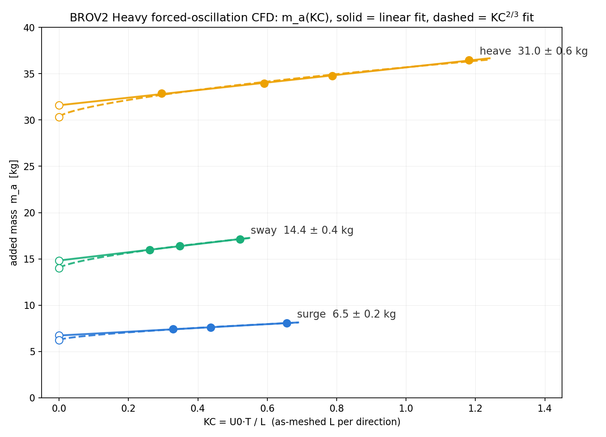

# BlueROV2 Heavy — Hydrodynamic Coefficients from Open-Source CFD & BEM

Fossen-model hydrodynamic coefficients for the BlueROV2 Heavy, derived from
the raw vendor CAD (STL assembly) with OpenFOAM 12 and capytaine 2.3.1.
Campaign closed 2026-07-14. All solver logs, case directories, fit scripts
and raw fit JSONs referenced below live in this repository.

## 1. Geometry, meshes, reference quantities

- Source geometry: `BROV2-HEAVY-ASM-BROV2-HEAVY-R1.STL` (raw CAD assembly,
  6.18 M triangles, not watertight — 1191 parts, frozen propellers). Scaled
  mm → m; as-meshed bounding-box extents used throughout (vehicle frame):
  **surge L_x = 0.45720 m, sway L_y = 0.57484 m, heave L_z = 0.25385 m**.
- Steady-drag mesh (`rovCase`, earth-frame): 391k cells, snappyHexMesh, no
  boundary layers, maxNonOrtho 63.8, maxSkew 3.23, Mesh OK.
- Oscillation mesh (`rovOsc`, vehicle-frame, body-centred, domain ±2.30 m
  ≈ ±5 L): 934,645 cells, Mesh OK (nonOrtho 63.9, skew 3.45), single fluid
  region, closed BROV2 wall patch (32,183 faces).
- Solid volume of the as-meshed body from the patch integral:
  **V_solid = 0.01440 m³ → ρV_solid = 14.40 kg** (ρ = 1000 kg/m³). This is
  the Froude–Krylov mass subtracted in every oscillation fit, reported
  separately per run in the tables below. Across the mesh-convergence
  family V_solid converges monotonically (R ≈ 0.20) to a Richardson limit
  ≈ 0.01423 m³ — the CAD-with-props displacement, +6% over von Benzon's
  bare-vehicle 0.0134 m³.
- BEM surrogate: watertight envelope rebuilt by voxel closing + marching
  cubes (`bem/BROV2_watertight.stl`, 13,988 faces, V = 0.01993 m³ — closure
  inflates volume; the BEM matrix is therefore a **sealed-geometry
  potential-flow reference**).

## 2. Methods

**Steady drag sweep** (`rovCase_u*`): foamRun/incompressibleFluid, kOmegaSST
with wall functions, 5 speeds 0.2–1.0 m/s in surge; forces functionObject,
converged means (window drift < 0.3%).

**BEM added mass** (`bem/A3_matrix.py`): capytaine radiation problems at
10 m depth, ω ∈ [1, 5] rad/s (frequency-independent to 0.01%); symmetrized
6×6 in `bem/added_mass.json`. Method rehearsal on a submerged sphere:
+1.98% vs 0.5ρV analytic.

**Forced-oscillation CFD** (`rovOsc*`): the body is fixed; the far-field
inflow oscillates, U(t) = U0 sin(2πt/T) along one vehicle axis (sine
`uniformFixedValue` inlet, `pressureInletOutletVelocity` outlet, slip
sides). kOmegaSST, backward time scheme, Δt = T/150, 5 periods (750 steps,
~23 min on 8 cores). The inline force over the last 3 periods is fit to the
Morison form

    F(t) = c0 + α·dU/dt + β·U|U|,   m_a = α − ρV_solid,   β = ½ρ·Cd·A

with A the bounding-box area normal to the motion (surge 0.14593, sway
0.11606, heave 0.26282 m²). Method rehearsal on a sphere: m_a within +0.8%
of the analytic value, frequency-shift check −0.08%. The Morison-fit script
(`scripts/morison_fit.py`) reproduces the archived Step-2a fits to
< 0.0002 kg.

**KC convention**: KC = U0·T / L with the as-meshed extent L along the
oscillation direction (values above).

## 3. m_a(KC) — per-direction results

Every fit: r² ≥ 0.997, residual = RMS/peak of the fitted signal. α and
ρV_solid = 14.40 kg are reported separately; m_a = α − 14.40.

**Surge (x), L = 0.45720 m, A = 0.14593 m²**

| case | U0 [m/s] | T [s] | KC | α [kg] | m_a [kg] | Cd | r² | resid |
|---|---|---|---|---|---|---|---|---|
| rovOsc_s_U0.1 | 0.1 | 1.5 | 0.328 | 21.81 | **7.41** | 2.04 | 0.9996 | 1.4% |
| rovOsc_s_T1.0 | 0.2 | 1.0 | 0.437 | 22.01 | **7.61** | 1.91 | 0.9993 | 1.9% |
| rovOsc_s_U0.2 | 0.2 | 1.5 | 0.656 | 22.47 | **8.07** | 1.75 | 0.9986 | 2.8% |

**Sway (y), L = 0.57484 m, A = 0.11606 m²**

| case | U0 [m/s] | T [s] | KC | α [kg] | m_a [kg] | Cd | r² | resid |
|---|---|---|---|---|---|---|---|---|
| rovOsc_w_U0.1 | 0.1 | 1.5 | 0.261 | 30.37 | **15.97** | 3.96 | 0.9994 | 1.8% |
| rovOsc_w_T1.0 | 0.2 | 1.0 | 0.348 | 30.81 | **16.41** | 3.66 | 0.9988 | 2.5% |
| rovOsc_w_U0.2 | 0.2 | 1.5 | 0.522 | 31.54 | **17.14** | 3.36 | 0.9973 | 3.7% |

**Heave (z), L = 0.25385 m, A = 0.26282 m²**

| case | U0 [m/s] | T [s] | KC | α [kg] | m_a [kg] | Cd | r² | resid |
|---|---|---|---|---|---|---|---|---|
| rovOsc_h_U0.05 | 0.05 | 1.5 | 0.295 | 47.26 | **32.86** | 3.51¹ | 0.9998 | 1.0% |
| rovOsc_h_U0.1 | 0.1 | 1.5 | 0.591 | 48.34 | **33.94** | 3.19 | 0.9992 | 2.0% |
| rovOsc_h_T1.0 | 0.2 | 1.0 | 0.788 | 49.17 | **34.77** | 2.98 | 0.9986 | 2.7% |
| rovOsc | 0.2 | 1.5 | 1.182 | 50.87 | **36.47** | 2.71 | 0.9969 | 4.1% |

¹ weakly identified: at U0 = 0.05 the drag amplitude is ~1.2 N against a
~10 N inertial peak.



## 4. KC → 0 extrapolation (the reported added mass)

Both extrapolation forms are fit per direction; the official coefficient is
the **midpoint of the two intercepts ± half their spread**
(extrapolation-model uncertainty), with each fit's statistical intercept SE
alongside (`scripts/kc_extrapolation.py`, `step2b_results.json`).

| direction | linear a + b·KC | a + b·KC^(2/3) | **official m_a [kg]** | BEM envelope [kg] | bracket |
|---|---|---|---|---|---|
| surge | 6.73 ± 0.03 (b = 2.05) | 6.24 ± 0.09 (b = 2.41) | **6.49 ± 0.24 (model) ** | 9.75 | [3, 13] ✓ |
| sway | 14.83 ± 0.08 (b = 4.45) | 13.99 ± 0.04 (b = 4.87) | **14.41 ± 0.42 (model)** | 14.14 | [5, 18] ✓ |
| heave | 31.59 ± 0.09 (b = 4.09) | 30.33 ± 0.35 (b = 5.36) | **30.96 ± 0.63 (model)** | 35.03 | — ✓ |

Surge and heave settle below the sealed-envelope BEM bound (0.67× and
0.88×), as expected for an open frame. Sway lands essentially **at** the
envelope (1.02×): the sway direction presents the largest flat-plate area
(side panels + vertical-thruster ducts) and shows the strongest sharp-edge
augmentation; its Graham-form intercept (13.99) is just below the bound,
its linear intercept (14.83) just above — the model spread covers the
envelope value.

## 5. Coefficient sheet (von Benzon Table A1 format)

Values are positive added-mass/damping magnitudes; in SNAME/Fossen sign
convention the hydrodynamic derivatives are the negatives (e.g.
X_u̇ = −6.49 kg). Rotation coefficients are about the BEM volume centroid,
which is offset (+0.0085, −0.0022, +0.0347) m (vehicle frame) from the CFD
CofR (bounding-box centre).

| coeff | value | provenance |
|---|---|---|
| X_u̇ | **6.49 ± 0.24 kg** | CFD forced-oscillation, KC→0 midpoint of linear/KC^(2/3) intercepts ± half spread (stat. SE 0.03/0.09) |
| Y_v̇ | **14.41 ± 0.42 kg** | same (stat. SE 0.08/0.04) |
| Z_ẇ | **30.96 ± 0.64 kg** | same (stat. SE 0.09/0.35); propagated incl. mesh ±0.39% and dt ±0.16% (§7) |
| K_ṗ | **0.4145 kg·m²** | BEM sealed-geometry potential-flow reference, about BEM volume centroid |
| M_q̇ | **0.2536 kg·m²** | BEM sealed-geometry potential-flow reference, about BEM volume centroid |
| N_ṙ | **0.2474 kg·m²** | BEM sealed-geometry potential-flow reference, about BEM volume centroid |
| K_L (X_u) | **0.388 ± 0.028 N·s/m** | steady CFD drag sweep 0.2–1.0 m/s, linear+quadratic fit through origin |
| K_Q (X_u|u|) | **36.25 ± 0.03 N·s²/m²** | same (pure-quadratic alternative: 36.69 ± 0.06); refined-mesh limit ≈ 35.3 (§7) |

Mesh certification (§7): Z_ẇ carries ±0.39% (mesh) ± 0.16% (dt), giving the
propagated **Z_ẇ = 30.96 ± 0.64 kg** (model spread dominant); surge/sway
mesh uncertainty is assumed to be of the same class (±0.4%), subdominant to
their quoted model spreads.

Context: Li et al. 2020 CFD reports K_Q ≈ 38.2 (−5% vs ours); the
von Benzon 2022 experimental damping (X_u = 13.7, X_u|u| = 141) is ~4×
larger, attributed to tether and methodology differences. The BEM envelope
diagonal exceeds von Benzon's Table A1 added masses by 1.5–2.2×,
consistent with the inflated sealed volume.

## 6. Modelling notes

- **KC dependence.** m_a rises monotonically with KC in every direction
  (sharp-edge vortex augmentation, Keulegan–Carpenter 1958; Graham 1980).
  A body operated at finite oscillation amplitude carries more added mass
  than the KC→0 coefficient: e.g. **operational heave at KC ≈ 1.2 runs
  m_a ≈ 36.5 kg** vs the tabulated 30.96 kg. The full m_a(KC) tables above
  are the modelling reference; pick the value matching the expected motion
  amplitude.
- **Cd(KC).** Oscillatory drag coefficients fall as KC rises — measured
  low/high-KC ratios 1.10–1.18 per direction vs Graham's sharp-edge
  KC^(−1/3) prediction of 1.26 — and are far above the steady-flow value
  (surge oscillatory Cd 1.75–2.04 vs steady 0.51 on the same area).
- **Frequency independence.** BEM: 0.01% variation over ω ∈ [1, 5] rad/s.
  Viscous CFD: the T = 1.0 s runs land on the m_a(KC) curve defined by the
  T = 1.5 s runs to within 0.02 kg (surge) / 0.03 kg (sway) — m_a is a
  function of KC, not of frequency, over the tested range.
- **Off-diagonal couplings ≈ 0.** BEM off-diagonals ≤ 0.33 kg
  (discretization noise; matrix symmetrized). CFD acceleration-phase cross
  forces in heave: A_xz = −0.09 kg, A_yz = +0.002 kg. Treat the added-mass
  matrix as diagonal at this fidelity.

## 7. Mesh convergence (Richardson/GCI study, Celik et al. 2008)

Both production meshes were embedded in refinement families (background
cell size scaled by r ≈ 1.33 per step; snappy levels (2 3), feature level
3, buffers, wake box, domain and all numerics identical; checkMesh gates
nonOrtho < 65 / skew < 4 passed by every member; representative
h = (V_fluid/N)^(1/3)).

**Drag family (steady surge at 0.6 m/s, production mesh = medium):**

| mesh | N cells | h | F [N] | iters | y⁺ avg/max |
|---|---|---|---|---|---|
| coarse | 189,868 | 45.00 mm | 13.5700 | 500 | 71.6 / 238 |
| medium | 391,032 | 35.37 mm | 13.2853 | 500 | 51.6 / 206 |
| fine | 836,517 | 27.45 mm | 12.7698 | 1000 | 37.9 / 152 |
| v.fine | 1,833,168 | 21.14 mm | 12.8925 | 1000 | 27.2 / 137 |

The first three meshes are formally divergent (R = 1.81): each refinement
resolves new sub-centimetre CAD geometry, so the family is not
self-similar. The 4th mesh shows the effect saturating, with a sign flip
(oscillatory): |ε43| = 0.123 < |ε32|/r = 0.397, apparent |ε|-decay order
p ≈ 5.5 over meshes 2–4, Richardson limit F_ext ≈ 12.93 N, finest-pair
oscillation band [12.77, 12.89] N. The production value 13.29 N sits
+2.7% above the Richardson limit → certified as-is under the ≤3% rule,
with the refined-mesh trend pointing lower. Since Cd is near-constant
across the sweep this propagates multiplicatively: K_Q = 36.25 with a
refined-mesh limit ≈ 35.3 N·s²/m².

**Added-mass family (heave at KC = 0.591, production mesh = medium).**
Δt = T/150 certified by a T/300 guard on the medium mesh (m_a shift
0.155% < 0.5% gate). Each mesh's own patch-integral ρV_solid enters its
Froude–Krylov subtraction:

| mesh | N cells | h | α [kg] | ρV_solid [kg] | m_a [kg] |
|---|---|---|---|---|---|
| coarse | 409,677 | 61.93 mm | 48.747 | 15.050 | 33.697 |
| medium | 934,645 | 47.05 mm | 48.342 | 14.392 | 33.950 |
| fine | 2,154,773 | 35.61 mm | 47.949 | 14.263 | 33.685 |

Family spread 0.78% (registered prediction was ≤2–3%), oscillating about
33.8 kg (R = −1.04): α falls smoothly with refinement while ρV_solid falls
in near-lockstep, and their difference is mesh-insensitive. Certified:
**m_a(heave, KC 0.591) = 33.95 ± 0.13 (mesh, oscillatory convention)
± 0.05 (dt) kg.** A fine-mesh check at KC = 1.18 gives m_a = 36.11 kg
(−0.36 kg vs the medium-mesh curve) with the KC-slope preserved to 4%
(4.11 vs 4.28 kg/KC): a slow mesh drift in α not fully cancelled by the
V_solid correction admits a ~1% one-sided systematic toward lower m_a;
the coefficient sheet is unchanged within its quoted uncertainty.

## 8. Limits of this dataset (read before using)

Mesh discretization is quantified, not assumed (§7): drag carries a −2.7%
refined-mesh systematic toward its Richardson limit of 12.93 N with a
±0.5% oscillation band, and heave added mass carries ±0.39% (mesh) ±
0.16% (dt) plus a ~1% one-sided systematic toward lower m_a from the
fine-mesh KC = 1.18 check; surge/sway mesh uncertainty is assumed to be
of the same class (±0.4%), subdominant to the extrapolation-model spread.
The remaining limits: wall functions on meshes without resolved boundary
layers (y⁺ avg 38–72 across the drag family, dipping to 27 on the finest
mesh and into the buffer layer at the lowest sweep speed); raw CAD
geometry with frozen propellers and no tether; the rotational added
masses are sealed-geometry BEM values about the BEM centroid, not viscous
CFD values — and the BEM matrix should be read as a sealed-geometry
potential-flow reference rather than a strict upper bound, since the sway
result shows that directions dominated by enclosed cavities can reach it;
translational coefficients depend on the KC→0 extrapolation model, and
the quoted ± covers only the two forms tested (linear, KC^(2/3)) over
KC ∈ [0.26, 1.18]; the oscillating-inflow method assumes uniform ambient
acceleration (exact Froude–Krylov subtraction for a uniform stream); no
free-surface effects (deeply submerged assumption).

## 9. Reproducing

```
# steady drag point            # forced oscillation point
cd rovCase_u0.6                cd rovOsc_s_U0.1
mpirun -np 8 foamRun -parallel mpirun -np 8 foamRun -parallel
                               python3 scripts/morison_fit.py rovOsc_s_U0.1 x 1.5 0.1
# KC→0 extrapolation + plot
python3 scripts/kc_extrapolation.py   # -> step2b_results.json, step2b_ma_vs_KC.png
```

Key files: `scripts/morison_fit.py` (Morison fit, conventions in
docstring), `scripts/kc_extrapolation.py` (dual-model extrapolation,
brackets), `step2b_results.json` (full numbers), `heave_kc_results.json`
(Step 2a heave), `sweep_results.json` (drag sweep), `bem/added_mass.json`
(BEM 6×6), `bem/A*.py` (BEM pipeline).
